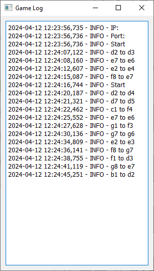

# Chess Game

## Overview

This is a chess game developed using **Python** and **PyQt5**. The game allows players to compete locally or online on a graphical chessboard. It includes full chess rules, time controls, and various features like chat and move history. The game supports both **player vs player** and **player vs computer** modes. 

---

## Screenshots

Here are some screenshots showing the gameplay, chat log, and board interface:

### Chess Game Interface

  
*The main game window showing the chessboard and controls.*

### Chat and Log

  
*The chat window showing the move history and ongoing chat between players.*

---

## Features

- **Graphical User Interface (GUI)**:  
  A clean and simple interface built using PyQt5 with an interactive chessboard and pieces that can be moved using the mouse or chat commands.

- **Real-time Gameplay**:  
  Players can move chess pieces and interact with the board in real-time. The game enforces alternating turns, preventing a player from making a move during the opponent's turn.

- **Chess Piece Movement**:  
  All chess pieces (pawn, rook, knight, bishop, queen, king) have their individual movement rules which are strictly followed during gameplay.

- **Game Modes**:
  - **VS Player**: Play against another person locally.
  - **VS Computer**: Play against an AI, though the computer can only make one move forward (limited intelligence).
  
- **Chess Clock**:  
  The game includes a chess clock with two different time modes:
  - **3+3** (3 minutes for each player, plus 3 seconds added per move).
  - **10+15** (10 minutes for each player, plus 15 seconds added per move).

- **Chat Functionality**:  
  Players can chat with each other during the game.

- **Mouse and Chat Input**:  
  Players can move their pieces using the mouse or by typing commands in the chat.

- **Move Restrictions**:  
  The game disables a player’s ability to make moves while it's the opponent’s turn.

- **Move History and Logs**:  
  The game logs all moves and displays them in a chat log. It also announces victory conditions (e.g., checkmate, resignation) in the chat.

- **Save and Load Game State**:  
  Players can save the current game state and later load it to analyze or continue the game from where they left off.

- **Reset Button**:  
  There is a button to reset the board and restart the game, resetting the clock as well.

- **Network Play**:  
  Players can connect over a network and play against each other with two running instances of the game.

---

## Usage

1. **Start the game**:
   - Open two instances of the game to play against another player locally or across a network.
   - Choose the mode (`VS Player` or `VS Computer`).

2. **Time Control**:
   - Set the game time by selecting a time control mode (3+3 or 10+15).

3. **Making Moves**:
   - You can move pieces by clicking and dragging them with the mouse.
   - Alternatively, you can type the moves in the chat (e.g., "e2 e4").

4. **View Move History**:
   - Every move is recorded in the log and displayed in the chat window.

5. **Saving and Loading**:
   - Save the game to resume later or load a previously saved game.

6. **Reset**:
   - Use the reset button to restart the game from scratch.

---

## Tech Stack

- **Backend**: Python, SQLite
- **Frontend**: PyQt5
- **Game Logic**: Python (Chess piece movement and rules)

---
